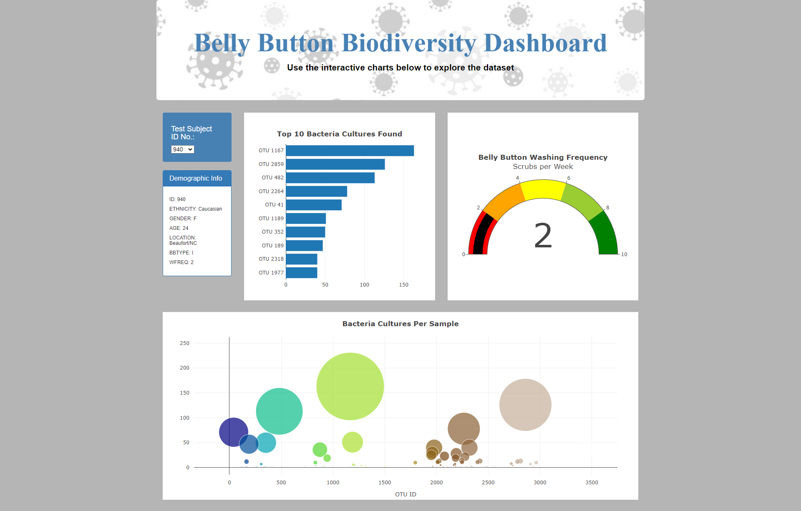

# Belly Button Biodiversity Dashboard

## Purpose
The purpose of this project was to create a web application dashboard using Javascript and Plotly to display belly button bacteria data from several different research volunteers.  The dashboard was to be interactive where the user could select the Test Subject ID number and the dashboard would display the results for that specific ID number.  The requested results to be displayed were:

1. Demographic Information
2. Bar chart of the top 10 bacteria cultures found
3. Indicator chart of belly button washing frequency
4. Bubble chart of bacteria cultures per sample

## Resources
Data Source: samples.json </br>
Software: VS Code, Javascript (ECMAScript 6), Plotly, Bootstrap, d3, HTML

## Results
The belly button biodiversity dashboard can be found at https://whitneylosinski.github.io/Belly_Button_Biodiversity/.  Creating the dashboard was completed in six major steps as follows.  

1. The first step in creating the dashboard was to create a basic html page containing a jumbotron for the title, a well where the Test Subject ID number would be selected, a panel for the demographic information to be displayed and 3 graphs to display the data.  Bootstrap was used as a stylesheet to help format the html page and d3, plotly and samples.json were included as script tags to read the data.

   One important note about the HTML file is that in order to select the correct dataset when a Test Subject ID No. is chosen, the html `onchange` code calls the JavaScript function `optionChanged()`.  The argument for the `optionChanged()` function is set as `this.value` in the html code, meaning that the new ID number that is selected from the drowdown menu, now becomes the new argument for the JavaScript function.  See the code below.

   ```html
        <h4>Test Subject<br>ID No.:</h4>
        <!-- <select id="selDataset"></select> -->
        <select id="selDataset" style="color: black"; onchange="optionChanged(this.value)"></select>
   ```

2. The second step of creating the dashboard was to write a function to initialize the dashboard as shown below.  The variable `selector` was assigned to the html element with an id equal to "selDataset" to grab a reference to the dropdown select element.  The samples.json file was then read and assigned the variable `data`.  From `data`, the names array was assigned to the variable `sampleNames` and for each sample name, a dropdown menu option was appended to the html code, with the sample ID assigned as the "text" and the "value" property.  The first sample from the list was then used to build the initial plots and the dashboard was initialized.

   ```js
   function init() {
     // Grab a reference to the dropdown select element
     var selector = d3.select("#selDataset");

     // Use the list of sample names to populate the select options
     d3.json("samples.json").then((data) => {
         var sampleNames = data.names;

         sampleNames.forEach((sample) => {
            selector
               .append("option")
               .text(sample)
               .property("value", sample);
            });

         // Use the first sample from the list to build the initial plots
         var firstSample = sampleNames[0];
         buildCharts(firstSample);
         buildMetadata(firstSample);
     });
   }

   // Initialize the dashboard
   init();
   ```
   
3.  The third step of creating the dashboard was to write a function to define what happens when a different Test Subject ID is selected from the dropdown menu.  This was done using the `optionChanged()` function to take in the `newSample` argument and build the metaData and Charts using functions that are defined later.
   
   ```js
   function optionChanged(newSample) {
      // Fetch new data each time a new sample is selected
      buildMetadata(newSample);
      buildCharts(newSample);  
   }
   ```
  
4. The fourth step of creating the dashboard was to create the demographics panel that would display the general information about each test subject.  Again, a function was written to take in the argument of the Test Subject ID number and read the json file.  The metadata array from the data file was assigned the variable `metadata` and filtered for the desired sample number.  The panel with an id equal to `sample-metadata` was then selected from the html file and assigned to the variable `PANEL`.  The panel data was cleared and then the data array for the sample number was iterated through to display each key and value as a new h6 tag on the PANEL in the html file.
 
   ```js
   // Demographics Panel 
   function buildMetadata(sample) {
      d3.json("samples.json").then((data) => {
         var metadata = data.metadata;
         // Filter the data for the object with the desired sample number
         var resultArray = metadata.filter(sampleObj => sampleObj.id == sample);
         var result = resultArray[0];
         // Use d3 to select the panel with id of `#sample-metadata`
         var PANEL = d3.select("#sample-metadata");

         // Use `.html("") to clear any existing metadata
         PANEL.html("");

         // Use `Object.entries` to add each key and value pair to the panel
         Object.entries(result).forEach(([key, value]) => {
            PANEL.append("h6").text(`${key.toUpperCase()}: ${value}`);
         });
      });
     }
   ```
  
5. The fifth step of creating the dashboard was to create a function to build each of the charts.  Within the function, the json data was read into the variable `data` and the "samples" array from the data was assigned to `samples`.  The samples array was then filtered for the object with the desired Test Subject ID number and assigned to the variable `resultArray` and the first item in the result array was assigned to `Result`.  Next, variables were created to hold the data for the otu_ids, otu_labels and sample_values from the data.  To get the y data labels, the otu_ID's were mapped through to add "OTU " in front of the ID and then reversed so that the ID's with the largest values were last.  See the script below.

   ```js
   // Create the buildCharts function.
   function buildCharts(sample) {
      // Load and retrieve the samples.json file 
      d3.json("samples.json").then((data) => {
         // Create a variable that holds the samples array. 
         var samples = data.samples;
         // Create a variable that filters the samples for the object with the desired sample number.
         var resultArray = samples.filter(sampleObj => sampleObj.id == sample); 
         //  Create a variable that holds the first sample in the samples array.
         var Result = resultArray[0];
         // Create variables that hold the otu_ids, otu_labels, and sample_values.
         var otuID = Result.otu_ids;
         var otuLabel = Result.otu_labels;
         var sampleValue = Result.sample_values.map((value) => parseInt(value));
         // Create the yticks for the bar chart. (Top 10 otu_ids in descending order
         var yticks = otuID.slice(0,10).map((id) => "OTU " + id).reverse();
   ```
   
   Next, the bar chart was built using the variables above.  The x values were set as the first 10 items in the `sampleValue` data defined above, sorted in reverse order.  The y values were the `yticks` defined above, the hover labels were set to the `otuLabel` defined above and the type of chart was set to "bar".  Some additional formatting was added to the chart along with a layout which included the title of the chart and then the plot was charted using Ploytly. (Not all of the formatting included in the final product is shown below for the sake of shortening the summary.
   
   ```js
         // Create the trace for the bar chart. 
         var barData = {
            x: sampleValue.slice(0,10).reverse(),
            y: yticks,
            hovertemplate: otuLabel,
            type: "bar",
            orientation: "h",
            backgroundColor: "rgb(192, 189, 189)"
         };
         
         // Create the layout for the bar chart. 
         var barLayout = {
            title: {text: "<b>Top 10 Bacteria Cultures Found</b>"},
         };
         
         // Use Plotly to plot the data with the layout. 
         Plotly.newPlot("bar", [barData], barLayout);
   ```
   
   The same script format was followed again to build a bubble chart using Plotly.  This time, the chart type was set as "bubble" and the markers for the bubbles were set to be sized based on the sampleValue with colors based on otuID.  See the script below.
   
   ```js
         // Create the trace for the bubble chart.
         var bubbleData = {
            x: otuID,
            y: sampleValue,
            type: "bubble",
            text: otuLabel,
            hoverinfo: "x+y+text",
            mode: "markers",
            marker: {size: sampleValue, color: otuID, colorscale: "Earth"}
         };

         // 2. Create the layout for the bubble chart.
         var bubbleLayout = {
            title: {text: "<b>Bacteria Cultures Per Sample</b>"},
            xaxis: {title: "OTU ID"},
            hovermode: "closest"
         };

         // 3. Use Plotly to plot the data with the layout.
         Plotly.newPlot("bubble", [bubbleData], bubbleLayout);
   ```    
   
   The final chart created was an indicator chart showing how often each of the test subjects washed their belly buttons per week.  For this chart, the metadata array from the data was used and filtered for the desired Test Subject ID number and the first sample from the resulting array was assigned to the `Result` variable.  From that data, the "wfreq" data was converted to a floating decimal and saved as the `wFreq` variable.  The indicator gauge graph was then formatted and created using Plotly as shown below.
       
   ```js
         // Create a variable that holds the metadata array.
         var metadata = data.metadata;
         // Create a variable that filters the metadata array for the object with the desired sample number.
         var resultArray = metadata.filter(sampleObj => sampleObj.id == sample);
         // Create a variable that holds the first sample in the metadata array.
         var Result = resultArray[0];
         // Create a variable that holds the washing frequency.
         var wFreq = parseFloat(Result.wfreq);
         // Create the trace for the gauge chart.
         var gaugeData = {
            type: "indicator",
            value: wFreq,
            mode: "gauge+number",
            gauge: {
               axis: {range: [0,10], dtick: 2},
               bar: {color: "black"},
               steps: [
                  {range: [0,2], color: "red"},
                  {range: [2,4], color: "orange"},
                  {range: [4,6], color: "yellow"},
                  {range: [6,8], color: "yellowgreen"},
                  {range: [8,10], color: "green"}
               ],
            }
         };
    
         // Create the layout for the gauge chart.
         var gaugeLayout = { 
            title: {text: "<b>Belly Button Washing Frequency</b><br>Scrubs per Week"},
         };
         
         // Use Plotly to plot the gauge data and layout.
         Plotly.newPlot("gauge", [gaugeData], gaugeLayout);
      });
   }
   ```

6. The final step in creating the belly button biodiversity dashboard was to edit the html file to apply formatting changes to the web application and make it more visually appealing to the user.  After this was done the dashboard was created as shown below.




<hr></hr>


**Contact:** </br>
email: whitney.losinski@gmail.com</br>
linkedin: https://www.linkedin.com/in/whitneylosinski/
